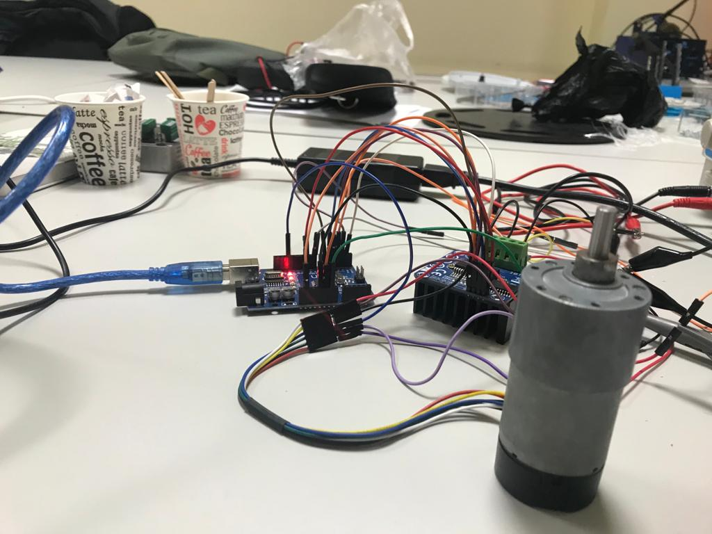
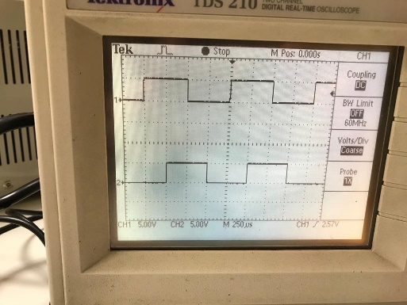
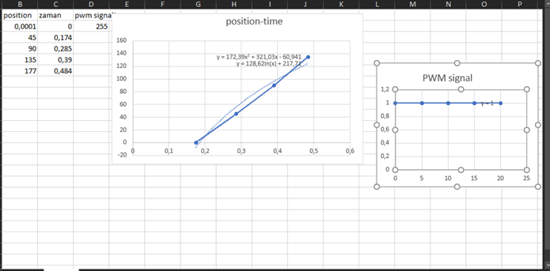
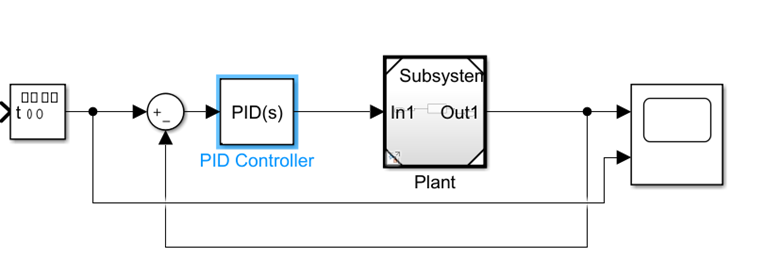
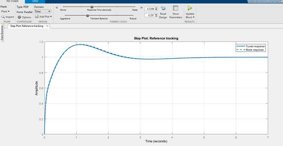
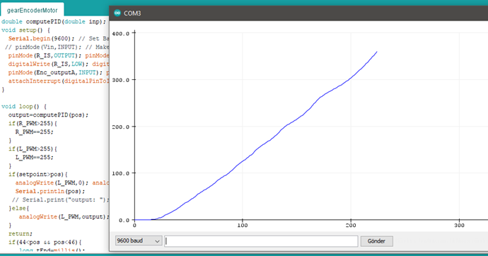

Firstly, I connected DC motor to Arduino
and motor driver as in the *Figure 5*.

I examined encoder motor output-A and output-B duty cycle,
rising-falling edges and clockwise-counter clockwise results on
oscilloscope. Encoder gave us 2 output signals (*Figure 6* and *Figure
7*). So, I could analyze easily.

I examined encoder motor output-A and
output-B rising edges on oscilloscope when output-A rising, if output-B
is equal to 1 it means that motor rotating clockwise, if it is 0 it
means that motor counter clockwise. So, I applied "attachInterrupt
"method to count Encoder outputs' rising edges, experiment to 2100
rising or falling edges are equal to 360 degrees. So, we can say that
5.85 rising edges are equal to 1 degree.

When I control with if() conditions, motor had resonance, it generated
vibration. After that, I created PID control algorithm and applied the
Ziegler-Nichols method, for PID tuning parameters that are K~p~, K~i~,
and K~d~, which is:

1.  Set all gains to 0.

2.  Increase K~d~ until the system oscillates.

3.  Reduce K~d~ by a factor of 2-4.

4.  Set K~p~ to about 1% of K~d~.

5.  Increase K~p~ until oscillations start.

6.  Decrease K~p~ by a factor of 2-4.

7.  Set K~i~ to about 1% of K~p~.

8.  Increase K~i~ until oscillations start.

9.  Decrease K~i~ by a factor of 2-4.

Then, I determined PID parameters on
Matlab. First, I analyze time versus position graph and determining what
function is on excel at different setpoints as in the *Figure 8*.

Then, I created our model on Matlab as in
the *Figure 9*.

On PID Tuner on Matlab I determine PID
tuning parameters as what we want to see like response of the system.
Also, I calculated Laplace transform of transfer function and applying
values on Matlab to tune PID parameters.

Finally, test results were as expected.
Motor didn't have resonance and vibration (*Figure 11*).
